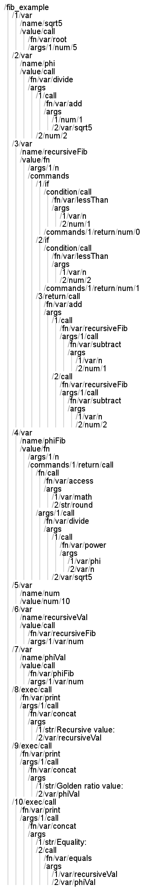

# Dirlang
Dirlang is an esoteric programming language based on directories. This repository includes a JavaScript compiler as well as an interpreter, however, compilation is much faster.

# Syntax
Other than directory names, Dirlang's syntax is completely different from text-based languages'. Directories are expected to be structured similarly to parse trees, recursively.

# Example

# Docs
## Statements
Statement lists, including the root directory, are expected to consist of numbered folders containing the actual statements, as seen in the example above.
### `var`
- Assigns a value to a variable. Variables can be shadowed.
- Parameters
  - `name` (raw): The variable's name
  - `value` (expression): The variable's value
### `if`
- If the given condition is true, it executes the given commands. Otherwise, it executes the "else" block, if given.
- Parameters
  - `condition` (expression): The condition
  - `commands` (statement list): The list of statements to execute if the condition is true
  - `else` (statement list): The list of statements to execute if the condition is false
### `while`
- Executes the given commands while the given condition is true
- Parameters
  - `condition` (expression): The condition
  - `commands` (statement list): The list of statements to execute while the condition is true
### `exec`
- Executes an expression. Useful for calling functions when the return value isn't needed.
- Parameter: The expression to execute
### `return`
- Returns a value from a function
- Parameter: The expression to return
### `break`
- Stops executing a loop

## Expressions
### `var`
- Gets the value of a variable. Since functions are considered variables too, you also have to use this expression when referring to functions.
- Parameter: The variable's name
### `str`
- Refers to a string (with some limitations because of folder names, depending on the OS)
- Parameter: The string's content
### `num`
- Refers to a number
- Parameter: The number's value. Use a dot (.) for the decimal place. Spaces are ignored. Scientific notation is supported: `<a>e+<b>` = `a*10^b` and `<a>e-<b>` = `a*10^(-b)`
### `bool`
- Refers to a boolean
- Parameter: For `true`, the folder should contain a folder named any placeholder. For `false`, the folder should be empty.
### `arr`
- Refers to an array with no specific length
- Parameter: The folder should contain a numbered (indexed) list of expressions
### `obj`
- Refers to a set of key-value pairs
- Parameter: The folder's sub-folders are the keys, and the sub-folders' children are the values (expressions)
### `fn`
- Refers to a function. This expression doesn't declare a function, it only creates a reference. You have to assign a function to a variable in order to refer to it later.
- Parameters
  - `args` (raw list): The function's argument names
  - `commands` (statement list): The commands to execute
### `call`
- Calls a function
- Parameters
  - `fn` (expression): The function to call. Can be a variable or a function expression (resulting in an IIFE).
  - `args` (expression list): A numbered list of expressions to pass to the functions as arguments